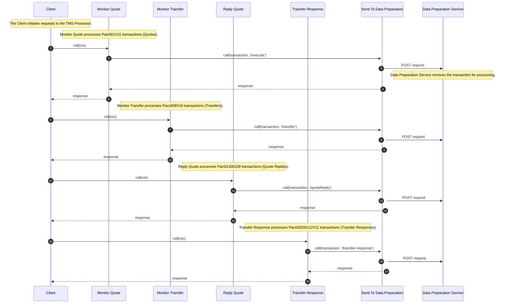

# TMS

## Overview

The TMS Processor is a service that receives transactions from the client and forwards them to the Data Preparation Service.

Here's a brief explanation of each participant:

- Client: The client initiates requests to the TMS Processor.
- Monitor Quote: This function processes Pain001V11 transactions, which represent quotes.
- Monitor Transfer: This function processes Pacs008V10 transactions, which represent transfers.
- Reply Quote: This function processes Pain01300109 transactions, which represent quote replies.
- Transfer Response: This function processes Pacs00200112V11 transactions, which represent transfer responses.
- Send To Data Preparation: This function sends the processed transactions to the Data Preparation Service for further processing.
- Data Preparation Service: This service receives the transaction and performs further processing on it.

## Sequence Diagram

